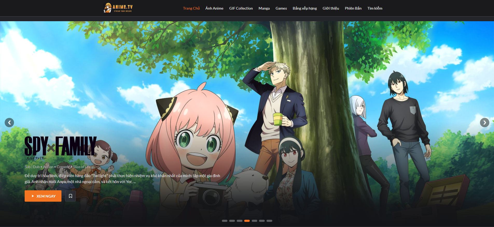
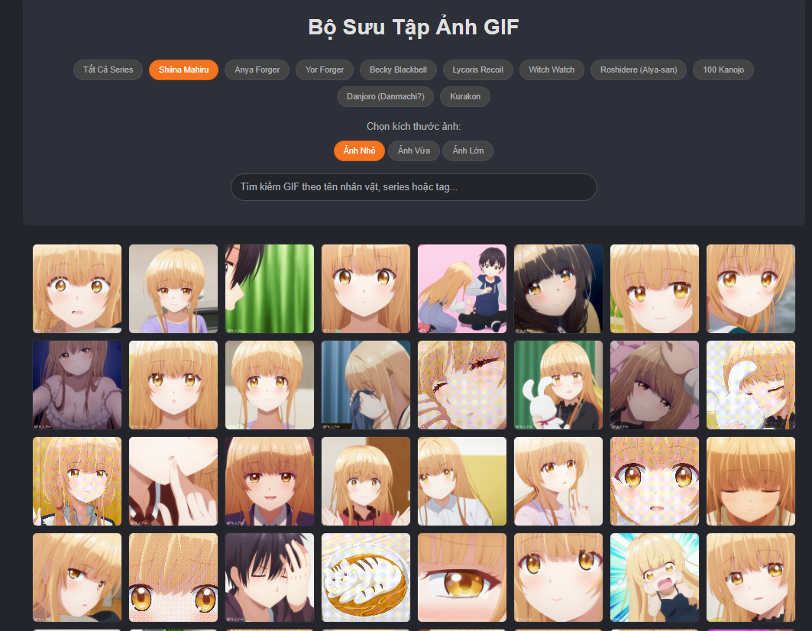

<!-- 

  

 -->

# ANIME.TV - Stream Your Dreams
*Một không gian để khám phá và thưởng thức Anime & Manga*

  

  

---

<strong> Tiếng Việt (Nhấn để xem)</strong>

Chào mừng bạn đến với ANIME.TV! Đây là một dự án website cá nhân được xây dựng với mục đích học hỏi, rèn luyện kỹ năng phát triển web và tạo ra một không gian để lưu trữ, khám phá nội dung liên quan đến Anime và Manga.

**Lưu ý quan trọng:** Trang web này được xây dựng với mục đích chính là học tập và thực hành, hoàn toàn **không có tính thương mại hóa** hay thu lợi nhuận. Mọi nội dung video và truyện tranh đều được lấy từ các nguồn chính thức và có bản quyền nhằm tôn trọng quyền sở hữu trí tuệ.

### Giới Thiệu

ANIME.TV là một không gian trực tuyến được tạo ra dành cho những người yêu thích văn hóa Anime và Manga. Tại đây, bạn có thể:

*   Khám phá và xem các video anime yêu thích (nhúng từ các nguồn như Vimeo, YouTube).
*   Duyệt qua bộ sưu tập hình ảnh và GIF chất lượng cao từ các bộ anime nổi tiếng.
*   Đọc các bộ truyện tranh hấp dẫn.
*   Giải trí với trò chơi ghép hình 3x3 dựa trên các nhân vật anime.

Trang web được thiết kế với giao diện người dùng thân thiện, lấy cảm hứng từ các nền tảng streaming phổ biến.

### Tính Năng Chính

*   **Trang Chủ:** Hiển thị các video anime nổi bật (slideshow), danh sách anime mới cập nhật, top picks.
*   **Chi Tiết Anime (`anime-detail.html`):** Thông tin chi tiết về một bộ anime, bao gồm mô tả, thể loại, danh sách các tập.
*   **Xem Video (`watch-video.html`):** Giao diện xem video và danh sách các tập khác trong series.
*   **Thư Viện Manga (`manga.html`):** Danh sách các bộ truyện tranh với ảnh bìa và thông tin cơ bản.
*   **Đọc Truyện (`reading-manga.html`):** Giao diện đọc truyện theo từng trang ảnh với các nút điều hướng.
*   **Bộ Sưu Tập Ảnh & GIF (`image-gallery.html`, `gif-collection.html`):** Hiển thị các hình ảnh artwork và GIF động.
*   **Game Xếp Hình (`game.html`):** Trò chơi ghép hình 3x3 với chế độ chơi classic và countdown.
*   **Thiết kế Responsive:** Giao diện tương thích trên nhiều kích thước màn hình.
*   **Dữ liệu động:** Nội dung được tải từ các file JavaScript (`data.js`) giúp dễ dàng quản lý.

### Công Nghệ Sử Dụng

*   **Ngôn ngữ:** HTML5, CSS3, JavaScript (Vanilla JS).
*   **Styling:** CSS thuần, sử dụng Flexbox và Grid Layout.
*   **Lưu trữ & Triển khai:** GitHub Pages.

### Hướng Dẫn Cài Đặt và Chạy

Đây là một dự án web tĩnh. Bạn có thể:
1.  **Mở trực tiếp file `index.html`** trong trình duyệt sau khi tải về.
2.  **Sử dụng Live Server** trong VS Code để có trải nghiệm phát triển tốt nhất.

### Đóng Góp

Đây là một dự án cá nhân. Tuy nhiên, mọi góp ý đều được chào đón. Vui lòng tạo một [Issue](https://github.com/TranHuuDat2004/anime.tv/issues) để thảo luận.

### Liên Hệ

*   **Người phát triển:** Trần Hữu Đạt
*   **GitHub:** [@TranHuuDat2004](https://github.com/TranHuuDat2004)

### Giấy Phép

Dự án này được phát hành dưới giấy phép [MIT License](LICENSE).

---

<strong> English (Click to view)</strong>

Welcome to ANIME.TV! This is a personal website project built for learning, practicing web development skills, and creating a space to store and explore content related to Anime and Manga.

**Important Note:** This website is built primarily for educational and practical purposes and is strictly **non-commercial**. All video and manga content is embedded from official, copyrighted sources to respect intellectual property rights.

### Introduction

ANIME.TV is an online space created for fans of Anime and Manga culture. Here, you can:

*   Discover and watch your favorite anime videos (embedded from sources like Vimeo, YouTube).
*   Browse a collection of high-quality images and GIFs from famous anime series.
*   Read engaging manga series.
*   Have fun with a 3x3 sliding puzzle game based on anime characters.

The website is designed with a user-friendly interface, inspired by popular streaming platforms.

### Key Features

*   **Homepage:** Displays featured anime videos (slideshow), a list of newly updated anime, and top picks.
*   **Anime Detail (`anime-detail.html`):** Shows detailed information about an anime series, including description, genres, and an episode list.
*   **Video Player (`watch-video.html`):** A video viewing interface with basic controls and a list of other episodes in the series.
*   **Manga Library (`manga.html`):** Displays a list of manga series with cover art and basic information.
*   **Manga Reader (`reading-manga.html`):** A page-by-page image reader interface with navigation controls.
*   **Image & GIF Galleries (`image-gallery.html`, `gif-collection.html`):** Showcases artwork, wallpapers, and animated GIFs from various series.
*   **Puzzle Game (`game.html`):** A 3x3 sliding puzzle game featuring anime images, with classic and countdown modes.
*   **Responsive Design:** The interface is compatible across multiple screen sizes (desktop, tablet, mobile).
*   **Dynamic Data:** Content is loaded from JavaScript data files (`data.js`, etc.), making it easy to manage and update.

### Technology Stack

*   **Languages:** HTML5, CSS3, JavaScript (Vanilla JS).
*   **Styling:** Pure CSS, utilizing Flexbox and Grid Layout for modern layouts.
*   **Hosting & Deployment:** GitHub Pages.
*   **Data Source:** Content is managed via JavaScript object files.

### Screenshots

Here are some screenshots of the main pages of ANIME.TV:

| Homepage                               | Anime Detail                             | Watch Video                               |
| :------------------------------------------------: | :------------------------------------------------------: | :--------------------------------------------------: |
|  |  |  |
| **Manga Library**                 | **Manga Detail**                          | **Manga Reader**                        |
|     |    |   |
| **Image Gallery**                | **Image Detail**                           | **Puzzle Game**                      |
|  |   |       |
| **GIF Gallery**                  |                                                          |                                                      |
|   |                                                          |                                                      |

### Getting Started

As this is a static web project based on client-side HTML, CSS, and JavaScript, you can run it as follows:

1.  **Open `index.html` directly:**
    *   Clone or download the project's source code.
    *   Open the `index.html` file in your web browser.
2.  **Use Live Server (Recommended for development):**
    *   If you use VS Code, install the "Live Server" extension.
    *   Right-click on `index.html` and select "Open with Live Server".

### Contributing

This is currently a personal project. However, if you have ideas or suggestions, please feel free to open an [Issue](https://github.com/TranHuuDat2004/anime.tv/issues) on this repository.

### Contact

*   **Developer:** Tran Huu Dat
*   **GitHub:** [@TranHuuDat2004](https://github.com/TranHuuDat2004)

### License

This project is released under the [MIT License](LICENSE). See the `LICENSE` file for more details.

---

  Thank you for checking out ANIME.TV!

