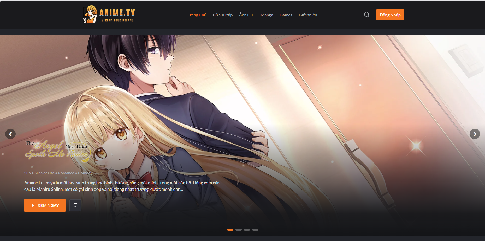
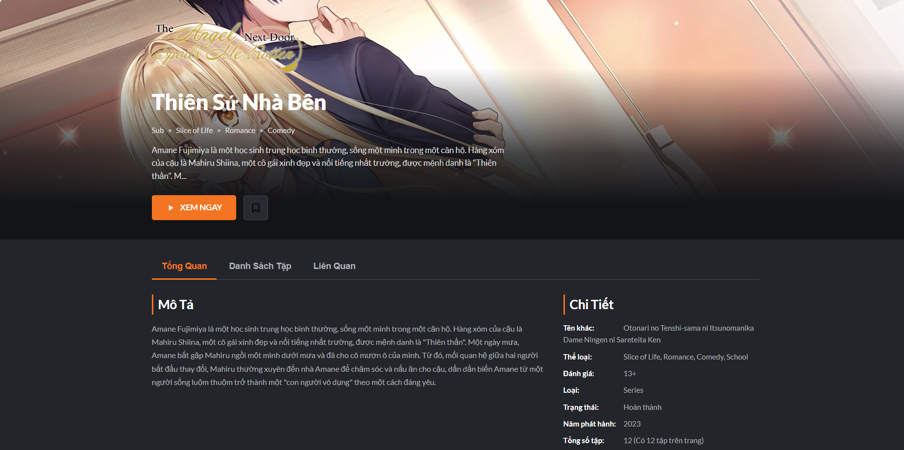
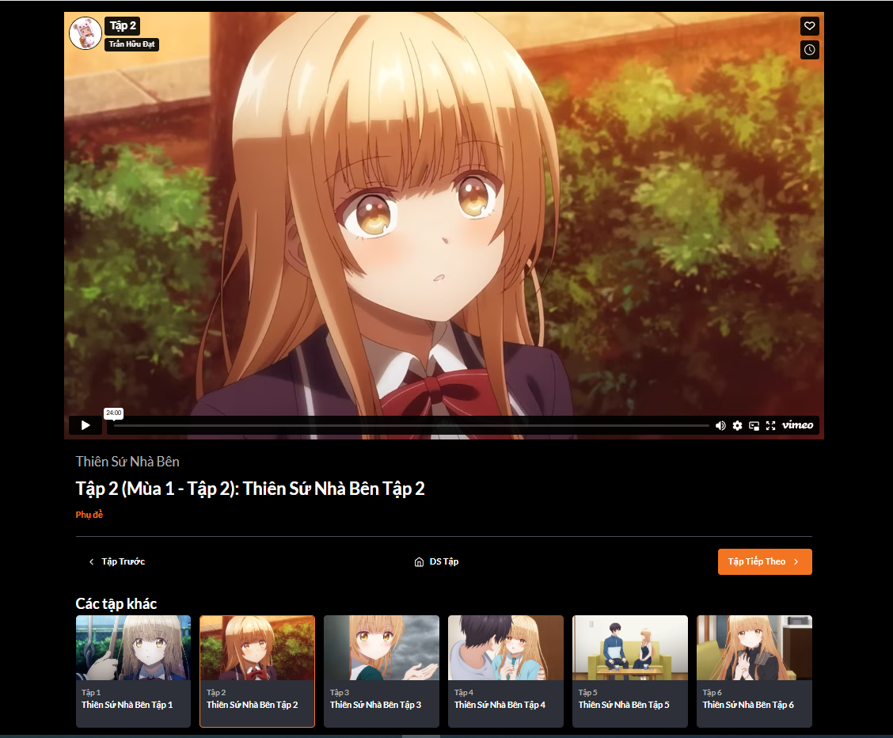
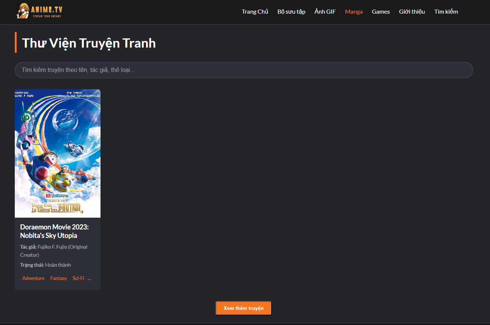
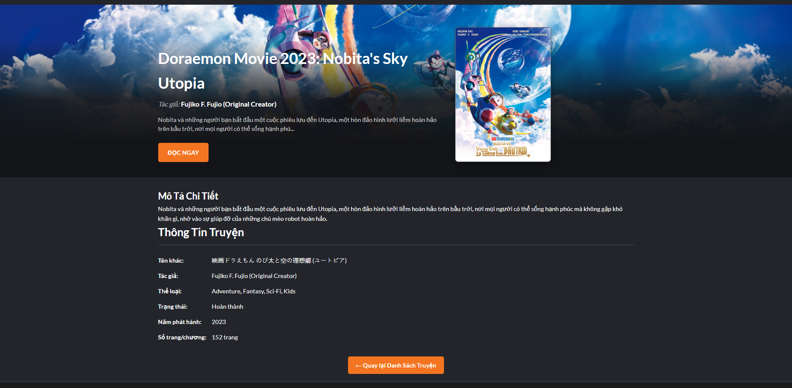
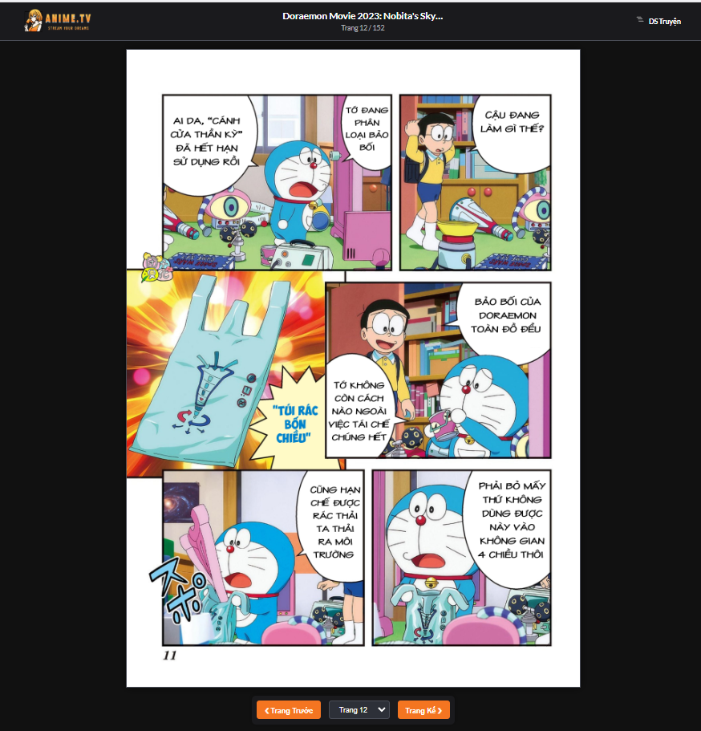
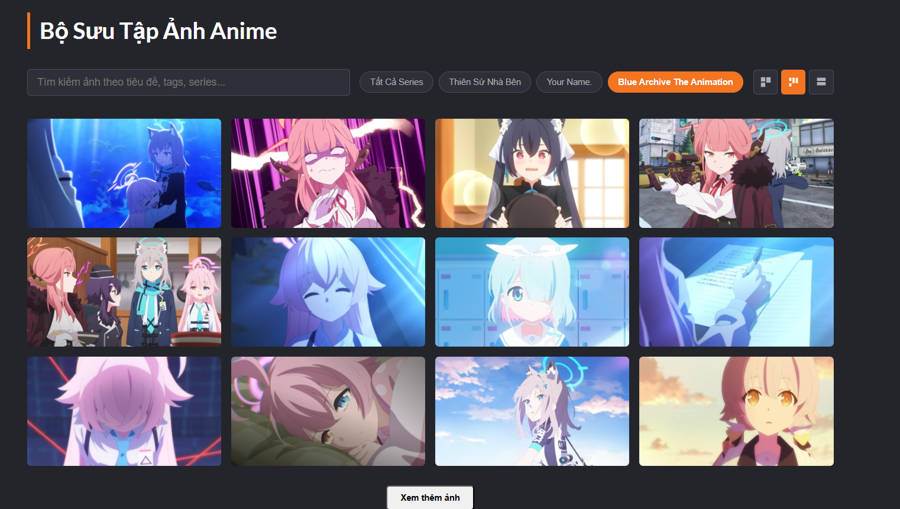
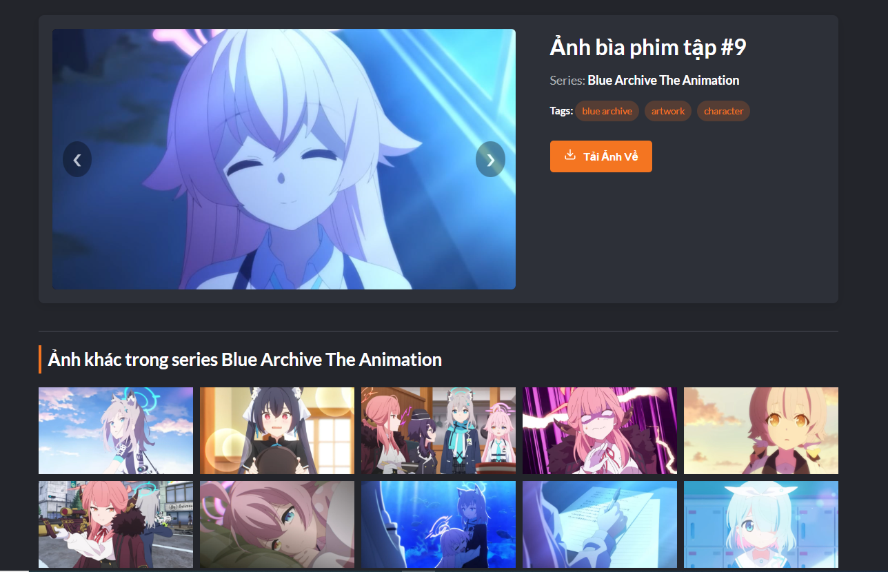
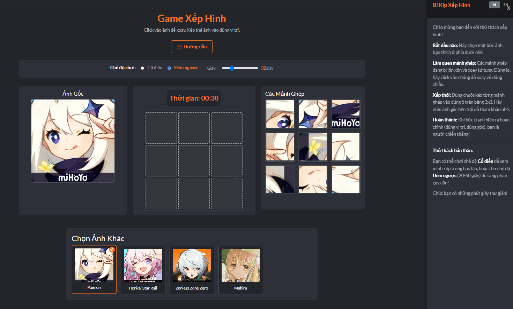

# ANIME.TV - Stream Your Dreams

Chào mừng bạn đến với ANIME.TV! Đây là một dự án website cá nhân được xây dựng với mục đích học hỏi, rèn luyện kỹ năng phát triển web và tạo ra một không gian để lưu trữ, khám phá nội dung liên quan đến Anime và Manga.

**Lưu ý quan trọng:** Trang web này được xây dựng với mục đích chính là học tập và thực hành, hoàn toàn **không có tính thương mại hóa** hay thu lợi nhuận. Mọi nội dung video và truyện tranh đều được lấy từ các nguồn chính thức và có bản quyền nhằm tôn trọng quyền sở hữu trí tuệ.

## Mục Lục

*   [Giới Thiệu](#giới-thiệu)
*   [Tính Năng Chính](#tính-năng-chính)
*   [Công Nghệ Sử Dụng](#công-nghệ-sử-dụng)
*   [Cấu Trúc Thư Mục Dự Án](#cấu-trúc-thư-mục-dự-án)
*   [Hướng Dẫn Cài Đặt và Chạy (Nếu có)](#hướng-dẫn-cài-đặt-và-chạy)
*   [Đóng Góp (Nếu có)](#đóng-góp)
*   [Kế Hoạch Phát Triển Tương Lai (Tùy chọn)](#kế-hoạch-phát-triển-tương-lai)
*   [Liên Hệ](#liên-hệ)
*   [Giấy Phép (Tùy chọn)](#giấy-phép)

## Giới Thiệu

ANIME.TV là một không gian trực tuyến được tạo ra dành cho những người yêu thích văn hóa Anime và Manga. Tại đây, bạn có thể:

*   Khám phá và xem các video anime yêu thích (nhúng từ các nguồn như Vimeo, YouTube).
*   Duyệt qua bộ sưu tập hình ảnh và GIF chất lượng cao từ các bộ anime nổi tiếng.
*   Đọc các bộ truyện tranh hấp dẫn.
*   Giải trí với trò chơi ghép hình 3x3 dựa trên các nhân vật anime.

Trang web được thiết kế với giao diện người dùng thân thiện, lấy cảm hứng từ các nền tảng streaming phổ biến.

## Tính Năng Chính

*   **Trang Chủ:** Hiển thị các video anime nổi bật (slideshow), danh sách anime mới cập nhật, top picks.
*   **Chi Tiết Anime (`anime-detail.html`):** Hiển thị thông tin chi tiết về một bộ anime, bao gồm mô tả, thể loại, danh sách các tập.
*   **Xem Video (`watch-video.html`):** Giao diện xem video với các nút điều khiển cơ bản và danh sách các tập khác trong series.
*   **Thư Viện Manga (`manga.html`):** Hiển thị danh sách các bộ truyện tranh với ảnh bìa và thông tin cơ bản.
    *   **Chi Tiết Manga (`manga-detail.html`):** Thông tin chi tiết về một bộ truyện, tác giả, số trang/chương, và nút đọc truyện.
    *   **Đọc Truyện (`reading-manga.html`):** Giao diện đọc truyện theo từng trang ảnh với các nút điều hướng.
*   **Bộ Sưu Tập Ảnh (`image-gallery.html`):** Hiển thị các hình ảnh artwork, wallpaper từ nhiều series anime.
    *   **Chi Tiết Ảnh (`image-detail.html`):** Xem ảnh lớn hơn, thông tin ảnh và nút tải về.
*   **Bộ Sưu Tập GIF (`gif-collection.html` - nếu có):** Hiển thị các ảnh GIF động.
    *   **Chi Tiết GIF (`gif-detail.html` - nếu có):** Xem GIF lớn hơn và nút tải về.
*   **Game Xếp Hình (`game.html`):** Trò chơi ghép hình 3x3 với các hình ảnh anime, có chế độ chơi classic và countdown.
*   **Trang Giới Thiệu (`about.html`):** Thông tin về dự án, người phát triển và công nghệ sử dụng.
*   **Thiết kế Responsive:** Giao diện tương thích trên nhiều kích thước màn hình (desktop, tablet, mobile).
*   **Dữ liệu động:** Nội dung được tải từ các file JavaScript (`data.js`, `data-img.js`, `data-manga.js`) giúp dễ dàng quản lý và cập nhật.

## Công Nghệ Sử Dụng

*   **Ngôn ngữ:** HTML5, CSS3, JavaScript (Vanilla JS).
*   **Styling:** CSS thuần, sử dụng Flexbox và Grid Layout cho bố cục.
*   **Font:** Lato (từ Google Fonts).
*   **Lưu trữ & Triển khai:** GitHub Pages.
*   **Nguồn Video (Nhúng):** Vimeo, YouTube (từ các kênh chính thức).
*   **Dữ liệu:** Được quản lý thông qua các file JavaScript object.

## Ảnh Chụp Màn Hình Giao Diện (Screenshots)

Dưới đây là một số ảnh chụp màn hình các trang chính của ANIME.TV:

### Trang Người Dùng

| Trang Chủ (Homepage)                               | Chi Tiết Anime (Anime Detail)                             | Xem Video (Watch Video)                               |
| :------------------------------------------------: | :------------------------------------------------------: | :--------------------------------------------------: |
|  |  |  |
| **Thư Viện Manga (Manga Library)**                 | **Chi Tiết Manga (Manga Detail)**                          | **Đọc Truyện (Manga Reader)**                        |
|     |    |   |
| **Bộ Sưu Tập Ảnh (Image Gallery)**                | **Chi Tiết Ảnh (Image Detail)**                           | **Game Xếp Hình (Puzzle Game)**                      |
|  |   |       |
| **Trang Giới Thiệu (About Page)**                  |                                                          |                                                      |
|   |                                                          |                                                      |

*Lưu ý: Các ảnh chụp màn hình trên chỉ mang tính chất minh họa và có thể được cập nhật khi giao diện phát triển.*

## Hướng Dẫn Cài Đặt và Chạy

Vì đây là một dự án web tĩnh dựa trên HTML, CSS và JavaScript phía client, bạn có thể chạy nó theo các cách sau:

1.  **Mở trực tiếp file `index.html`:**
    *   Clone hoặc tải về mã nguồn của dự án.
    *   Mở file `index.html` bằng trình duyệt web của bạn.
2.  **Sử dụng Live Server (Khuyến nghị cho phát triển):**
    *   Nếu bạn sử dụng VS Code, cài đặt extension "Live Server".
    *   Chuột phải vào file `index.html` và chọn "Open with Live Server".
3.  **Triển khai lên GitHub Pages:**
    *   Đẩy mã nguồn lên một repository trên GitHub.
    *   Trong phần Settings của repository, đi tới mục "Pages".
    *   Chọn nhánh (thường là `main` hoặc `master`) và thư mục (thường là `/root`) để triển khai.
    *   GitHub Pages sẽ cung cấp cho bạn một URL để truy cập website.

## Đóng Góp

Hiện tại, đây là một dự án cá nhân. Tuy nhiên, nếu bạn có ý tưởng hoặc góp ý, vui lòng tạo một [Issue](https://github.com/TranHuuDat2004/anime.tv/issues) trên repository này.

## Kế Hoạch Phát Triển Tương Lai (Tùy chọn)

*   Thêm tính năng tìm kiếm nâng cao và bộ lọc chi tiết hơn.
*   Cho phép người dùng tạo tài khoản và lưu danh sách yêu thích.
*   Xây dựng trang chi tiết cho từng ảnh/GIF.
*   Cải thiện giao diện người dùng và trải nghiệm người dùng.
*   Thêm nhiều nội dung anime, manga, ảnh, và game hơn.
*   Hỗ trợ đa ngôn ngữ cho toàn bộ trang web (hiện tại mới có cho game).

## Liên Hệ

*   **Người phát triển:** Trần Hữu Đạt
*   **GitHub:** [Link đến profile GitHub của bạn](https://github.com/TranHuuDat2004)
<!-- *   **Email:** [Địa chỉ email của bạn (nếu muốn)] -->

## Giấy Phép (Tùy chọn)

Dự án này được phát hành dưới giấy phép [MIT License]. Xem file `LICENSE` để biết thêm chi tiết .

---